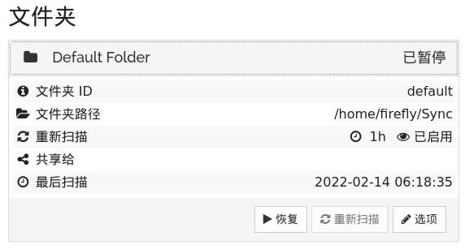

### [syncthing官网](https://syncthing.net)

### [syncthing使用说明](https://docs.syncthing.net/users/index.html)

### [syncthing代码](https://github.com/syncthing)

----

### syncthing安装包
* [Linux-x86-64版本](https://github.com/syncthing/syncthing/releases/download/v1.19.0/syncthing-linux-amd64-v1.19.0.tar.gz)
* [Linux-arm-64版本](https://github.com/syncthing/syncthing/releases/download/v1.19.0/syncthing-linux-arm64-v1.19.0.tar.gz)
* [Mac-x86-64版本](https://github.com/syncthing/syncthing/releases/download/v1.19.0/syncthing-macos-amd64-v1.19.0.zip)
* [Mac-arm-64版本](https://github.com/syncthing/syncthing/releases/download/v1.19.0/syncthing-macos-arm64-v1.19.0.zip)
* [Mac-universal版本](https://github.com/syncthing/syncthing/releases/download/v1.19.0/syncthing-macos-universal-v1.19.0.zip)
* [Windows-x86-64版本](https://github.com/syncthing/syncthing/releases/download/v1.19.0/syncthing-windows-amd64-v1.19.0.zip)
* [Windows-arm-64版本](https://github.com/syncthing/syncthing/releases/download/v1.19.0/syncthing-windows-arm64-v1.19.0.zip)

----

### 下载对应安装包并使用

1. **Linux示例**
```
# mkdir -p ~/syncthing/share
# cd syncthing
# mv ~/Downloads/syncthing-linux-amd64-v1.19.0.tar.gz .
# tar -xvf syncthing-linux-amd64-v1.19.0.tar.gz
# cd syncthing-linux-amd64-v1.19.0
# ./syncthing
```
----

### syncthing初始化配置
> syncthing初始启动后，根据提示进行初始设置

#### 设置WebUI的访问帐号及安全模式

1. **是否允许匿名报告**

*建议选 否*


2. **GUI设置**


点击 **设置** 按钮,进入设置页面


填写 **设备名** 后，点击 **编辑文件夹默认值** 进入文件夹默认设置页面


填写 默认使用的**文件夹路径**,此路径为默认的syncthing跟路径

继续在 **设置** 页面中进行 **图形用户界面配置**


在 **图形用户界面配置**中设置启用SSL以及帐号/密码后，完成GUI基本设置

----

#### 删除 **缺省文件夹**
点击 **Default fold**，**暂停** 此文件夹


点击 **选项**，进入文件夹设置页面，点击页面中**移除**按钮，移除默认文件夹


----

#### P2P链接设置

1. **获取本端设备标示**

打开**操作**栏，点击**显示ID**按钮


本端设备ID有字符、二维码两种获取方式


2. **进行P2P互认**

把本端的**设备ID**发送给需要建立P2P链接的对端，从对端发起互认(*或者获取对端设备ID，从本端发起*); 

认证发起方，点击**添加设备**按钮，进入添加设备页面：


认证发起方，填入对端**设备ID**，保存设置后，响应方收到确认页面并进行确认后，两端的P2P关系确认


----

#### 添加共享文件夹

1. **设置共享文件夹**

共享文件夹的发起方，通过WebUI的**添加文件夹**按钮进行共享文件夹设置


在填写**文件夹标签**、**文件夹路径**后，进入**共享**子也面进行共享设置


选择授权共享的**设备**后，可进入**高级**设置子页面，对文件夹的*发送/接收*权限进行设置(默认为*发送/接收*)


点击**保存**后，所有**被共享**的设备均能收到确认信息，被共享端可在接受后进行本地设置


最终文件夹共享状态，显示如下：


----

### 日常操作模式

2. **点对点双向共享**

设备A-文件夹A(发送/接收)<---->设备B-文件夹B(发送/接收); 

此模式下，任意一方对共享文件夹的改动会自动同步到对端

3. **点到多点双向共享**

设备A-文件夹A(发送/接收)<---->设备B/C/D..-文件夹B/C/D..(发送/接收); 

此模式下，任意一方对共享文件夹的改动会自动同步到对端

4. **点到多点单向共享-Down**

设备A-文件夹A(发送)---->设备B/C/D..-文件夹B/C/D..(接收); 

此模式下，A方共享文件夹的改动会自动同步到对端

5. **点到多点单向共享-Up**

设备A-文件夹A(接收)<----设备B/C/D..-文件夹B/C/D..(发送); 

此模式下，B/C/D..方共享文件夹的改动会自动同步到对端

6. **其他**

共享的模式通过设置文件夹的**发送/接收**模式可以灵活组合; 

*共享模式下如出现冲突,需要手工确认矫正*


